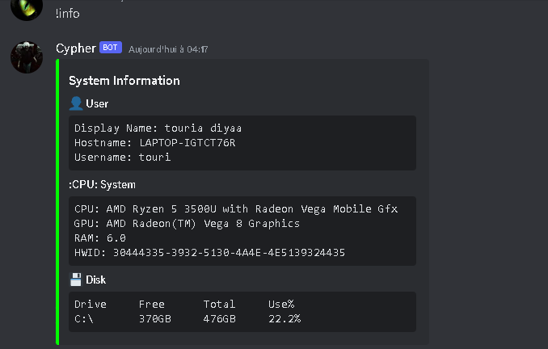
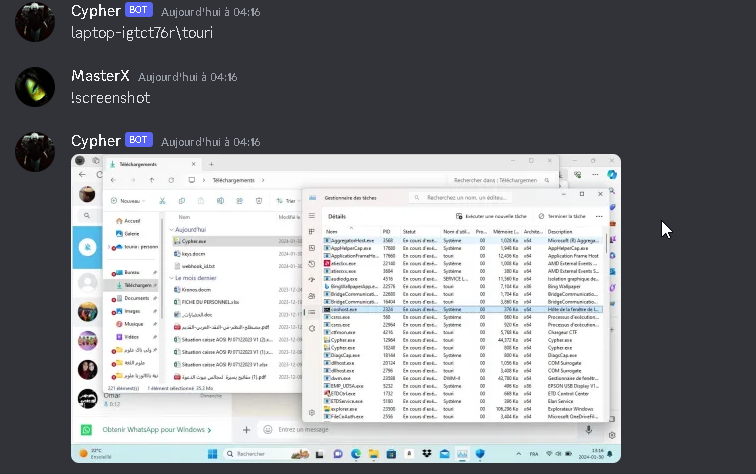

Greetings 
---------------------

DSC2 is a trojan that uses Discord as a c2 server 
-----------------------------

Warning !!!!!!
------------------

this may ban or desactivate your Discord account you have been warned !
---------------------------------
don t use your main acc

How it works ?
-------------------

the bot act as client for our discord server, when ever the programme runs on a host the bot creates a new private channel with a webhook in the server and check for the id of the channel if it matches the current channel you are sending message to it sends back data

this allows to have a session for each different client 

if programme is shutdown connexion is lost and you need to delete channel 

next time it connects new session channel is created

it needs 3 things :

-Discord bot token (create a discord bot)

-UserID token (this is to avoid bad usage)

-Guild token (your discord server id)

Setup
---------------------------------

pip install -r requirements

python DSC2.py

Features :
-----------------------

any cmd commande

!steal : steal cookies,webHistory,passwords,card bank account,downloads and then send them back via channel webhook

!screenshot : screenshot and send to server

!net : get wifi passwords and network info

!info : get system information like pc brand ,GPU ,CPU...

!startup (not added for good purpose)

DISCLAIMER :
-------------------------------

ME The author takes NO responsibility and/or liability for how you choose to use any of the tools/source code/any files provided. ME The author and anyone affiliated with will not be liable for any losses and/or damages in connection with use of DSC2. By using DSC2 or any files included, you understand that you are AGREEING TO USE AT YOUR OWN RISK. Once again DSC2 is for EDUCATION and/or RESEARCH purposes ONLY.

